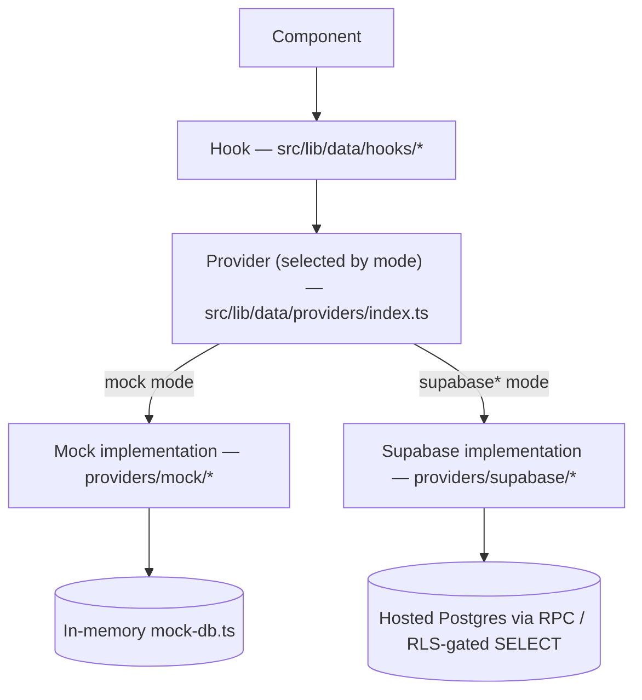

# Architecture

## Stack

Next.js 16 (App Router) · React 19 · TypeScript (strict) · Tailwind CSS · Supabase (Postgres + Auth). Path alias `@/*` → `./src/*`.

> This repo pins `next@16.2.11`. `AGENTS.md` carries a standing warning that this version has real breaking changes vs. older Next.js conventions your training data may assume — check `node_modules/next/dist/docs/` before writing code that touches routing/config APIs you're not certain about.

## Directory layout

```
src/
  app/                     Next.js App Router — routes live here (see Routes below)
    dashboard/             Every authenticated route nests under here (auth-guarded shell, see Routes)
    login/, change-password/   Two standalone unauthenticated/transitional routes
  components/              UI, organized by domain (tasks/, projects/, workstreams/, team-activity/, admin/, ui/, ...)
  lib/
    data/
      types/                Domain types (Task, Project, Workstream, User, DailyUpdate, TimeEntry, ...)
      providers/            Provider INTERFACES — one per domain (see Data Providers below)
      providers/mock/        In-memory implementations + seed data
      providers/supabase/    Real Supabase implementations
      permissions.ts        The entire authorization model (see authorization.md)
      hooks/                 One React hook per domain, wrapping the active provider
      provider-mode.ts      NEXT_PUBLIC_DATA_PROVIDER parsing — single source of truth for provider mode
      workstream-name.ts    Service display-name derivation
      task-display.ts       isTaskClosed / isTaskOverdue / isTaskActiveWork
      project-display.ts    isProjectActiveForNewWork / projectNotActiveMessage
    planner-dates.ts        Local-calendar-date utilities (see below) — use these, not raw Date/ISO slicing
    supabase/               Browser + server Supabase client factories
supabase/
  config.toml               LOCAL Supabase CLI dev config (not the hosted project's config — see data-and-supabase.md)
  migrations/                Chronological SQL migrations (see data-and-supabase.md)
```

## Data-provider architecture

Every domain (Companies, Projects, Workstreams, Tasks, Time Entries, Daily Updates, Admin Users, ...) is accessed through a **provider interface**, never directly. UI components call a **hook**, which calls the **provider** selected by `src/lib/data/providers/index.ts`, which is either the **mock** or **Supabase** implementation of that interface.



### The four provider modes (`NEXT_PUBLIC_DATA_PROVIDER`)

Defined and documented in `src/lib/data/provider-mode.ts`:

| Mode | Auth | Business data |
|---|---|---|
| `mock` (default, and the fail-safe fallback for an invalid value) | Mock | Everything mock |
| `supabase-auth` | Real Supabase | Everything else still mock — a transitional mode for testing real sign-in |
| `supabase-core` | Real | The "operational core" real (Companies, Workstreams, Activity Catalog, Tasks, Time Entries, Notifications) — everything else (Notes, Templates, Handoffs, Accomplishments Report, Saved Views, Daily Updates, Client Report) still mock |
| `supabase` | Real | Everything real |

An unrecognized value logs an error and falls back to `mock` rather than silently activating a real backend from a typo.

### Adding a new provider-backed domain

1. Define/extend the interface in `src/lib/data/providers/<domain>-provider.ts`.
2. Implement it in `providers/mock/mock-<domain>-provider.ts` (against `mock-db.ts`) and `providers/supabase/supabase-<domain>-provider.ts` (real Supabase calls/RPCs).
3. Add one line to `providers/index.ts`: `export const xProvider = <flag> ? supabaseXProvider : mockXProvider;`, picking whichever mode flag (`usesSupabaseAuth` / `usesSupabaseCoreData` / `usesSupabaseData`) matches when that domain "graduates" to real.

No other call site needs to change — every screen imports the provider by its stable name from `providers/index.ts`.

### Why mock data resets

`mock-db.ts`'s own comment: *"Resets to seed data on a full page reload — that's expected for a mock backend, not a bug."* It's a plain module-level object built from spread seed arrays; there is no persistence layer (no localStorage, no file write). Two fields (`dailyUpdates`, and similar) are intentionally seeded **empty** rather than from static fixtures — populated only by real in-app actions, matching production behavior. This matters for QA: build controlled test state via real UI flows in one continuous session, and don't hard-navigate/reload mid-test or you lose it. See `testing.md`.

## Local-date utilities

`src/lib/planner-dates.ts` is the one place date-only arithmetic and local-vs-UTC classification happen. **Use these, never a raw `new Date().toISOString().slice(0, 10)` or `timestamp.slice(0, 10)`** when the product question is "what's the user's calendar date":

| Function | Use for |
|---|---|
| `todayDateOnly()` | "Today" as a local `YYYY-MM-DD` string |
| `parseDateOnly(value)` / `formatDateOnly(date)` | Round-tripping a date-only string through a local (not UTC) `Date` |
| `dateKeyFromTimestamp(isoTimestamp)` | Classifying an absolute timestamp (e.g. a `TimeEntry.startTime`) by the LOCAL calendar day it falls on — this is the one correct way to bucket a timestamp by "day" |
| `localDayBoundsUtc(dateKey)` | Converting a local calendar day into the correct `{startUtc, endUtc}` instant range for a Postgres `timestamptz` range query |
| `addDays`, `startOfWeekMonday`, `weekDates`, `monthGridDates`, `isSameMonth` | Calendar-grid arithmetic (My Day's Week/Month views, etc.) |

Why this matters and what happens when it's skipped: see `troubleshooting.md`'s writeup of the CD-190 timezone defect.

## Routes

Every authenticated route lives under `/dashboard`, because `src/app/dashboard/layout.tsx` is the single auth-guarded shell (sidebar + topbar) — anything nested under it inherits the guard for free.

| Route | Purpose | Access notes |
|---|---|---|
| `/login` | Sign-in | Unauthenticated |
| `/change-password` | Forced first-login password change | Standalone, outside `/dashboard` on purpose (avoids a redirect loop through the dashboard guard) |
| `/dashboard` | Role dispatcher — renders the Employee/Supervisor/Superadmin dashboard | All roles |
| `/dashboard/my-day` | Today/Week/Month personal work + time view (absorbed the old standalone Planner) | All roles |
| `/dashboard/planner` | Redirect stub → `/dashboard/my-day?view=week` | Legacy bookmark compatibility only |
| `/dashboard/tasks`, `/dashboard/tasks/[id]` | Global Task list (List/Board/Timeline) and Task detail | List: Team Lead/Admin scope by default; Task detail per `canAccessTask` |
| `/dashboard/projects`, `/dashboard/projects/[id]` | Project portfolio and Project workspace (7 tabs: Overview/Services/Tasks/Members/Comments/Time/Reports) | Per `canAccessProject` |
| `/dashboard/workstreams/[id]` | One Service's detail page (no index route — reached via a Project) | Per `canAccessWorkstream` |
| `/dashboard/team-activity` | Merged Team Updates + Team Time (`?view=updates` / `?view=time`) | Team Lead/Admin only — Employee blocked, in-page message |
| `/dashboard/team-updates`, `/dashboard/team-time` | 307 redirects → the routes above | Legacy bookmark compatibility only |
| `/dashboard/companies`, `/dashboard/companies/[id]` | Technical company master record (Admin-level; day-to-day editing happens from the owning Project's Overview instead) | Admin |
| `/dashboard/reports`, `/dashboard/reports/[id]`, `/dashboard/reports/trash` | Accomplishments Report list/detail/trash | Team Lead/Admin |
| `/dashboard/reports/client`, `/dashboard/reports/client/[id]` | Client Report list/detail (name-free, client-facing) | Team Lead/Admin |
| `/dashboard/settings` | Profile / Appearance / Notifications / Workspace (Admin-only) / About | All roles, tab-gated |
| `/dashboard/admin/users` | User administration — create/edit/deactivate, global Service staffing, password reset | Admin only |
| `/dashboard/admin/services` | Global Service catalog admin (staffing viewed from the Service's own angle) | Admin only |

Not planned: any client-facing/public route. Client Contacts never authenticate — there is no portal.

## Team Activity implementation notes

See `domain-model.md` for the product-level description. Implementation: `src/app/dashboard/team-activity/page.tsx` owns shared `date`/`selectedUserId` state and calls both `useDailyUpdatesForDate` and `useTimeEntriesForDate` unconditionally (so switching tabs is instant, no refetch, no reload); `src/components/team-activity/team-activity-roster.tsx` is the one shared roster shell (avatar/name/role/selection), parameterized by a `dotClassFor`/`renderStatus` callback pair so each tab supplies its own status rendering without duplicating the shell. The two original detail panels (`TeamUpdatesDetail`, `TeamTimeDetail`) were kept as-is and are genuinely different — not merged, since their content isn't actually shared.
