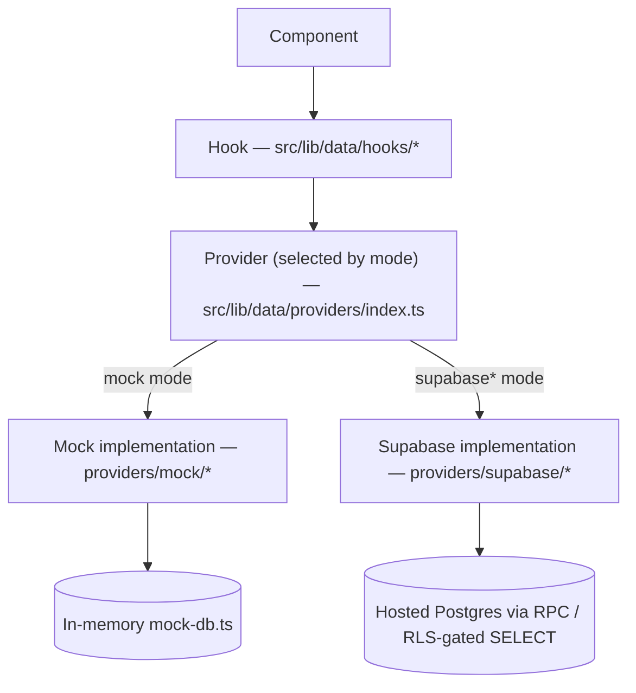

# Architecture

## Stack

Next.js 16 (App Router) · React 19 · TypeScript (strict) · Tailwind CSS · Supabase (Postgres + Auth). Path alias `@/*` → `./src/*`.

> This repo pins `next@16.2.11`. `AGENTS.md` carries a standing warning that this version has real breaking changes vs. older Next.js conventions your training data may assume — check `node_modules/next/dist/docs/` before writing code that touches routing/config APIs you're not certain about.

## Directory layout

```
src/
  app/                     Next.js App Router — routes live here (see Routes below)
    dashboard/             Every authenticated route nests under here (auth-guarded shell, see Routes)
    login/, change-password/   Two standalone unauthenticated/transitional routes
  components/              UI, organized by domain (tasks/, projects/, workstreams/, team-activity/, admin/, ui/, ...)
  lib/
    data/
      types/                Domain types (Task, Project, Workstream, User, DailyUpdate, TimeEntry, ...)
      providers/            Provider INTERFACES — one per domain (see Data Providers below)
      providers/mock/        In-memory implementations + seed data
      providers/supabase/    Real Supabase implementations
      permissions.ts        The entire authorization model (see authorization.md)
      hooks/                 One React hook per domain, wrapping the active provider
      provider-mode.ts      NEXT_PUBLIC_DATA_PROVIDER parsing — single source of truth for provider mode
      workstream-name.ts    Service display-name derivation
      task-display.ts       isTaskClosed / isTaskOverdue / isTaskActiveWork
      project-display.ts    isProjectActiveForNewWork / projectNotActiveMessage
    planner-dates.ts        Local-calendar-date utilities (see below) — use these, not raw Date/ISO slicing
    supabase/               Browser + server Supabase client factories
supabase/
  config.toml               LOCAL Supabase CLI dev config (not the hosted project's config — see data-and-supabase.md)
  migrations/                Chronological SQL migrations (see data-and-supabase.md)
```

## Data-provider architecture

Every domain (Companies, Projects, Workstreams, Tasks, Time Entries, Daily Updates, Admin Users, ...) is accessed through a **provider interface**, never directly. UI components call a **hook**, which calls the **provider** selected by `src/lib/data/providers/index.ts`, which is either the **mock** or **Supabase** implementation of that interface.


```mermaid
flowchart TD
    UI[Component] --> Hook[Hook — src/lib/data/hooks/*]
    Hook --> Provider["Provider (selected by mode) — src/lib/data/providers/index.ts"]
    Provider -->|mock mode| Mock[Mock implementation — providers/mock/*]
    Provider -->|supabase* mode| Supa[Supabase implementation — providers/supabase/*]
    Mock --> MemDB[(In-memory mock-db.ts)]
    Supa --> DB[(Hosted Postgres via RPC / RLS-gated SELECT)]
```

### The four provider modes (`NEXT_PUBLIC_DATA_PROVIDER`)

Defined and documented in `src/lib/data/provider-mode.ts`:

| Mode | Auth | Business data |
|---|---|---|
| `mock` (default, and the fail-safe fallback for an invalid value) | Mock | Everything mock |
| `supabase-auth` | Real Supabase | Everything else still mock — a transitional mode for testing real sign-in |
| `supabase-core` | Real | The "operational core" real (Companies, Workstreams, Activity Catalog, Tasks, Time Entries, Notifications) — everything else (Notes, Templates, Handoffs, Accomplishments Report, Saved Views, Daily Updates, Client Report) still mock |
| `supabase` | Real | Everything real |

An unrecognized value logs an error and falls back to `mock` rather than silently activating a real backend from a typo.

### Adding a new provider-backed domain

1. Define/extend the interface in `src/lib/data/providers/<domain>-provider.ts`.
2. Implement it in `providers/mock/mock-<domain>-provider.ts` (against `mock-db.ts`) and `providers/supabase/supabase-<domain>-provider.ts` (real Supabase calls/RPCs).
3. Add one line to `providers/index.ts`: `export const xProvider = <flag> ? supabaseXProvider : mockXProvider;`, picking whichever mode flag (`usesSupabaseAuth` / `usesSupabaseCoreData` / `usesSupabaseData`) matches when that domain "graduates" to real.

No other call site needs to change — every screen imports the provider by its stable name from `providers/index.ts`.

### Why mock data resets

`mock-db.ts`'s own comment: *"Resets to seed data on a full page reload — that's expected for a mock backend, not a bug."* It's a plain module-level object built from spread seed arrays; there is no persistence layer (no localStorage, no file write). Two fields (`dailyUpdates`, and similar) are intentionally seeded **empty** rather than from static fixtures — populated only by real in-app actions, matching production behavior. This matters for QA: build controlled test state via real UI flows in one continuous session, and don't hard-navigate/reload mid-test or you lose it. See `testing.md`.

## Local-date utilities

`src/lib/planner-dates.ts` is the one place date-only arithmetic and local-vs-UTC classification happen. **Use these, never a raw `new Date().toISOString().slice(0, 10)` or `timestamp.slice(0, 10)`** when the product question is "what's the user's calendar date":

| Function | Use for |
|---|---|
| `todayDateOnly()` | "Today" as a local `YYYY-MM-DD` string |
| `parseDateOnly(value)` / `formatDateOnly(date)` | Round-tripping a date-only string through a local (not UTC) `Date` |
| `dateKeyFromTimestamp(isoTimestamp)` | Classifying an absolute timestamp (e.g. a `TimeEntry.startTime`) by the LOCAL calendar day it falls on — this is the one correct way to bucket a timestamp by "day" |
| `localDayBoundsUtc(dateKey)` | Converting a local calendar day into the correct `{startUtc, endUtc}` instant range for a Postgres `timestamptz` range query |
| `addDays`, `startOfWeekMonday`, `weekDates`, `monthGridDates`, `isSameMonth` | Calendar-grid arithmetic (My Day's Week/Month views, etc.) |

Why this matters and what happens when it's skipped: see `troubleshooting.md`'s writeup of the CD-190 timezone defect.

## Contract / renewal information

Phase 6A/6B (CD-215/CD-216) locked the operational contract model. Three distinct concepts, on two tables, must never be conflated merely because two of them share a column name:

| Concept | Table.column | Meaning | Mutates on renewal? | Post-creation edit |
|---|---|---|---|---|
| Company Contract Start | `companies.contract_start_date` | The original client relationship start — master/reference data | Never | Admin-only |
| Company Renewal Date | `companies.renewal_date` | Preserved for compatibility only — **not** read as any Project's current contract | Never (no longer written by any renewal flow) | Admin-only |
| Project Client Since | `projects.contract_start_date` | The original Project/engagement start — a Project-owned fact, independent of the Company's own Contract Start even though they're often equal at creation | Never | Admin-only |
| Project legacy contract term | `projects.contract_months` / `projects.contract_end_date` | Pre-Phase-6A rolling-duration fields — preserved, not dropped, **no longer the authoritative current contract** | N/A — dormant | Admin-only (same guard as Client Since) |
| Current Contract | `project_contract_periods` rows | The authoritative, Project-owned annual contract period | Yes — `renew_project_contract_period` (Phase 6B) records the successor of the current leaf, both dates server-derived | Admin-only (`create_initial_project_contract_period` for the first period; `correct_initial_project_contract_period_start`/`delete_latest_project_contract_period` for narrow mistake-correction — see below) |

**Ownership**: contracts belong to **Project**, never Company — a Company may have several genuinely distinct Projects/engagements over time, but annual renewal is never the reason a second Project exists (the retired `renew_project` RPC — see `data-and-supabase.md` — enforced exactly this before being dropped; `project_contract_periods` is the modern replacement, operating on the SAME Project, never creating another one).

**Period model**: every recorded period ends December 31 of its own start year (`2026-05-04 → 2026-12-31`; `2026-01-01 → 2026-12-31`). A renewal period always starts January 1, exactly one day after its predecessor's `period_end`. "Current" is never stored — `src/lib/data/contract-periods.ts`'s `getCurrentProjectContractPeriod` derives it fresh (`period_start <= today <= period_end`) every time, using `planner-dates.ts`'s date-only primitives, never `.toISOString().slice(0, 10)`. The same module's `getProjectContractPeriodDisplayState` derives Past/Current/Upcoming for the Contract History list — also never stored. An Admin may record a renewal before the current period has expired (e.g. recording 2027 in October 2026); the prior period stays "Current" until its own `period_end`, and the new one renders "Upcoming" until its own `period_start`.

**Renewal (Phase 6B, CD-216)**: `renew_project_contract_period(p_project_id)` — Admin/superadmin-only, requires the Project's lifecycle to be Active or On Hold (Completed/Canceled/Archived/Trash are rejected) and an existing recorded chain; both dates are always server-derived from the current leaf (the one period nothing else has renewed from), never accepted from the caller. Locks the Project row for the duration of the call so two concurrent renewal attempts on the same Project serialize rather than race.

**Narrow mistake-correction (Phase 6B, CD-216)**: `delete_latest_project_contract_period` removes ONLY the current leaf period (a period with a successor can never be removed directly — remove each later leaf first, one at a time, so the chain is never left disconnected); removing a Project's sole root period is allowed. `correct_initial_project_contract_period_start` corrects the root period's `period_start` ONLY while it remains the Project's sole recorded period (`period_end` always recomputed server-side; `created_at`/`created_by` untouched) — rejected outright once any renewal history exists. Neither is a lifecycle transition; lifecycle status never blocks either one.

**Truthfulness**: `project_contract_periods` rows represent actual recorded business periods, never mathematically-generated guesses from an old `contractStartDate`. The Phase 6A migration backfilled zero rows for this reason — see `data-and-supabase.md`'s migration entry and `decisions.md`'s Phase 6 entry.

## Routes

Every authenticated route lives under `/dashboard`, because `src/app/dashboard/layout.tsx` is the single auth-guarded shell (sidebar + topbar) — anything nested under it inherits the guard for free.

| Route | Purpose | Access notes |
|---|---|---|
| `/login` | Sign-in | Unauthenticated |
| `/change-password` | Forced first-login password change | Standalone, outside `/dashboard` on purpose (avoids a redirect loop through the dashboard guard) |
| `/dashboard` | Role dispatcher — renders the Employee/Supervisor/Superadmin dashboard | All roles |
| `/dashboard/my-day` | Today/Week/Month personal work + time view (absorbed the old standalone Planner) | All roles |
| `/dashboard/planner` | Redirect stub → `/dashboard/my-day?view=week` | Legacy bookmark compatibility only |
| `/dashboard/tasks`, `/dashboard/tasks/[id]` | Global Task list (List/Board/Timeline) and Task detail | List: Team Lead/Admin scope by default; Task detail per `canAccessTask` |
| `/dashboard/projects`, `/dashboard/projects/[id]` | Project portfolio and Project workspace (7 tabs: Overview/Templates/Tasks/Members/Comments/Time/Reports — visible "Services" tab renamed "Templates" in Phase 1, CD-206) | Per `canAccessProject` |
| `/dashboard/workstreams/[id]` | One Template's detail page (no index route — reached via a Project); internal route segment stays `workstreams`, unrenamed | Per `canAccessWorkstream` |
| `/dashboard/team-activity` | Merged Team Updates + Team Time (`?view=updates` / `?view=time`) | Team Lead/Admin only — Employee blocked, in-page message |
| `/dashboard/team-updates`, `/dashboard/team-time` | 307 redirects → the routes above | Legacy bookmark compatibility only |
| `/dashboard/companies`, `/dashboard/companies/[id]` | Technical company master record (Admin-level; day-to-day editing happens from the owning Project's Overview instead) | Admin |
| `/dashboard/reports`, `/dashboard/reports/[id]`, `/dashboard/reports/trash` | Accomplishments Report list/detail/trash | Team Lead/Admin |
| `/dashboard/reports/client`, `/dashboard/reports/client/[id]` | Client Report list/detail (name-free, client-facing) | Team Lead/Admin |
| `/dashboard/settings` | Profile / Appearance / Notifications / Workspace (Admin-only) / About | All roles, tab-gated |
| `/dashboard/admin/users` | User administration — create/edit/deactivate, global Template staffing, password reset | Admin only |
| `/dashboard/admin/templates`, `/dashboard/admin/templates/[id]` | Global Template catalog admin (list + Phase 1's new per-Template detail page — name/description/Activities/compact staffing); internal `service_lines`/`ServiceLine` persistence unrenamed | Admin only |
| `/dashboard/admin/services` | 307 redirect → `/dashboard/admin/templates` | Legacy bookmark compatibility only |

Not planned: any client-facing/public route. Client Contacts never authenticate — there is no portal.

## Team Activity implementation notes

See `domain-model.md` for the product-level description. Implementation: `src/app/dashboard/team-activity/page.tsx` owns shared `date`/`selectedUserId` state and calls both `useDailyUpdatesForDate` and `useTimeEntriesForDate` unconditionally (so switching tabs is instant, no refetch, no reload); `src/components/team-activity/team-activity-roster.tsx` is the one shared roster shell (avatar/name/role/selection), parameterized by a `dotClassFor`/`renderStatus` callback pair so each tab supplies its own status rendering without duplicating the shell. The two original detail panels (`TeamUpdatesDetail`, `TeamTimeDetail`) were kept as-is and are genuinely different — not merged, since their content isn't actually shared.
